# How to install : IntelliJ IDEA Ultimate

JetBrains is the wonderful company behind a lot of awesome IDEs like CLion, PyCharm and IntelliJ.

IntelliJ being the IDE that we would be using in this semester's course, in this guide we will take a look at how to get a license for it and how to download and install it.

**Step 1 and Step 2 can be done with a smartphone, but after that you would need a laptop/computer.**

## Step 1 : Register for an account with JetBrains

1. Go to the JetBrains' official [website](https://www.jetbrains.com/)

   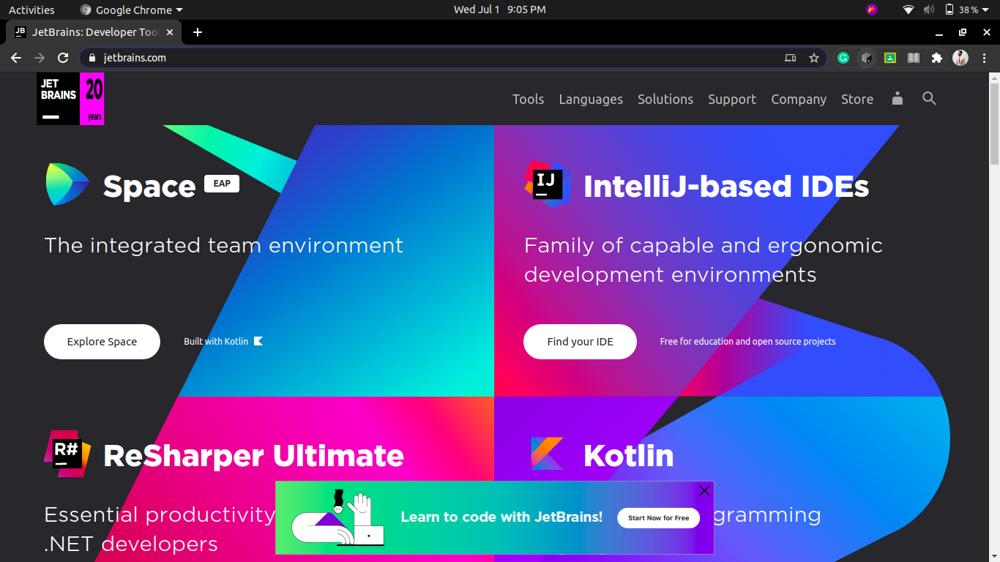

2.  Click on the small user icon located at the top-right hand corner of the website, near the search icon.

   

3. It will take you to the registration / log in page, we will register for a new account with JetBrains first. Enter your official GLA email address ex (firstname.lastname_cs19@gla.ac.in).

   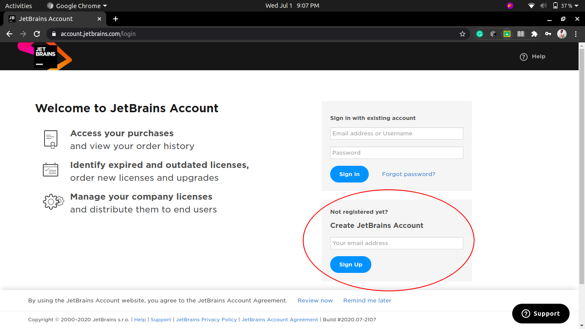 

4.  After that, it will tell you that it has sent an email on your official GLA email address. Nice! Remember to save the login username and password in the Google Chrome browser.

   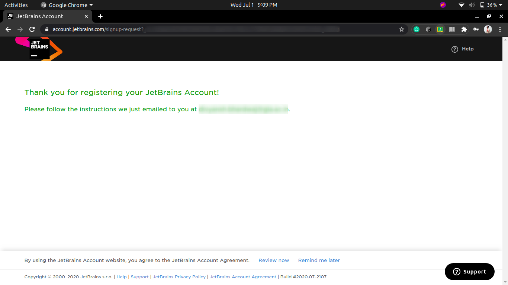

5.  Next, we need to go to our email and check the email from the JetBrains website. Here it is, just click on confirm / agree / yes.

   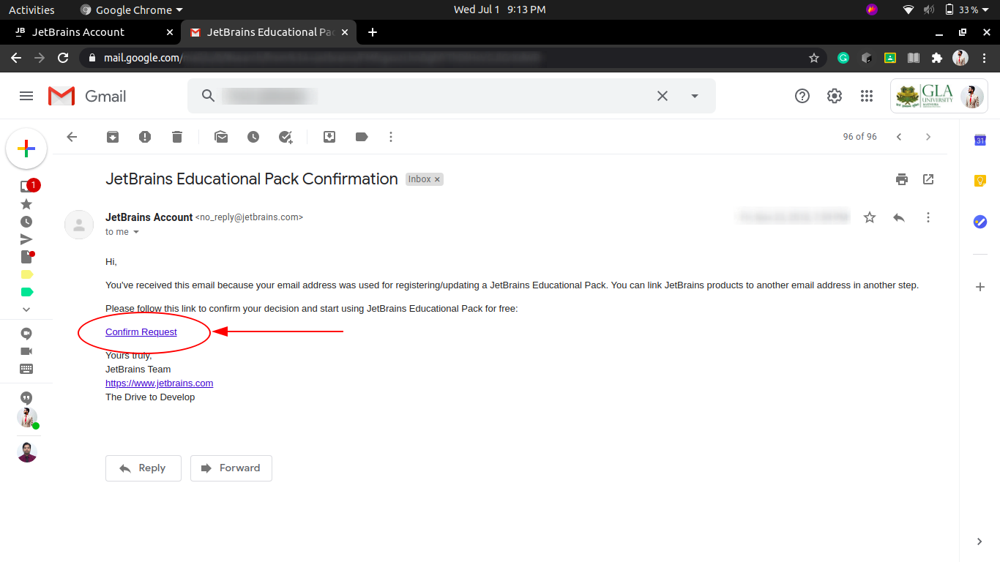

6.  Congratulations, you have create an account on JetBrains successfully!

---

## Step 2 : Register for a Student License with JetBrains

1.   Go to the [Student License Registration Page](https://www.jetbrains.com/shop/eform/students).

   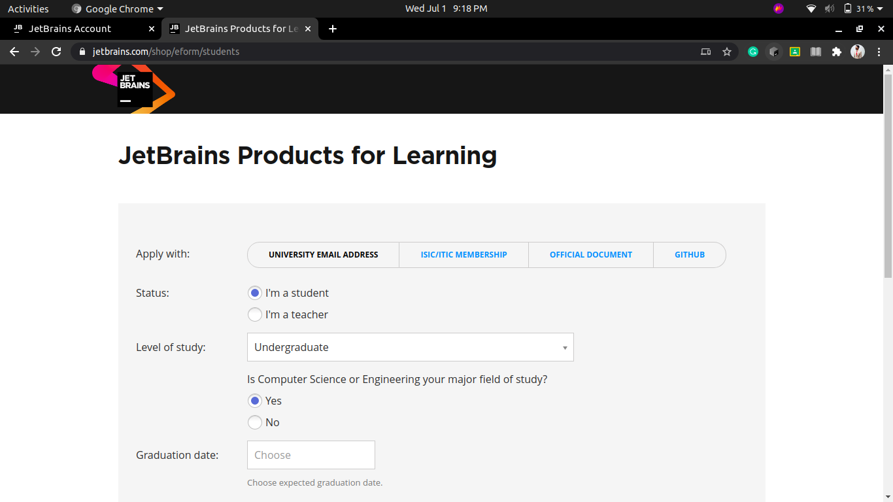

2.  Next fill out the entries and remember to use your official GLA email address. Click on the checkboxes that say "I have read ..." and "I consent ...". Then, click apply for free products.

   

   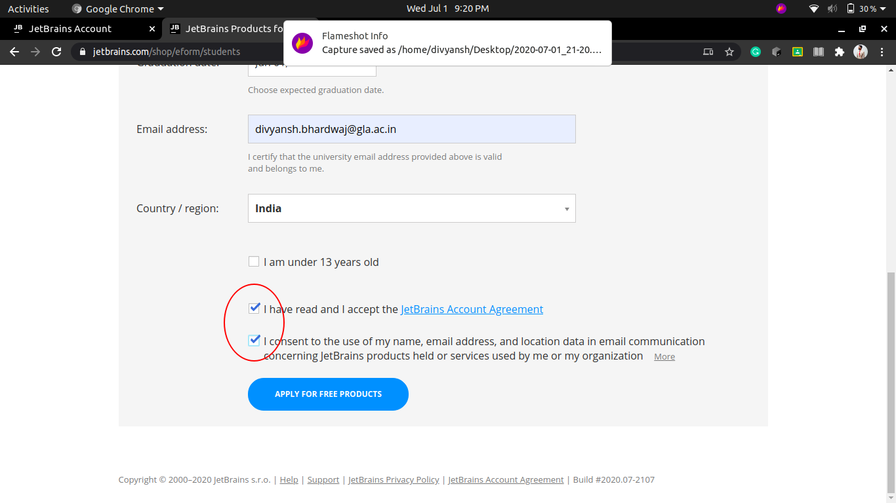

3.  You will again see the screen that say, you have been sent an email on your official GLA email address.

4.  Go to your email inbox, find the new email from JetBrains, open it, and click on confirm / agree / yes.

5.  Finally, you will see the licenses page with your name on it like this.

   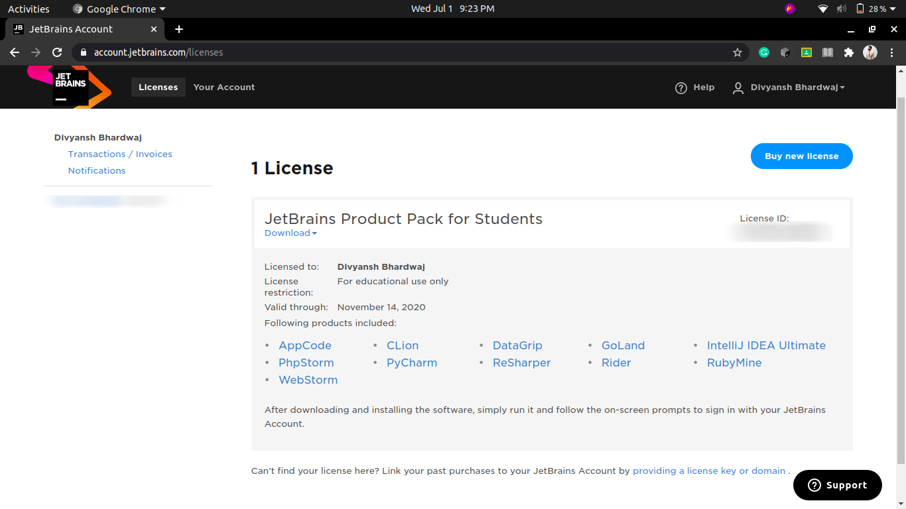

6.  Congratulations, you have just received the full students' license for FREE!

---

## Step 3 : Download the ToolBox app from the JetBrains website.

1. Go to the toolbox app page on the JetBrains Website [here](https://www.jetbrains.com/toolbox-app/).

   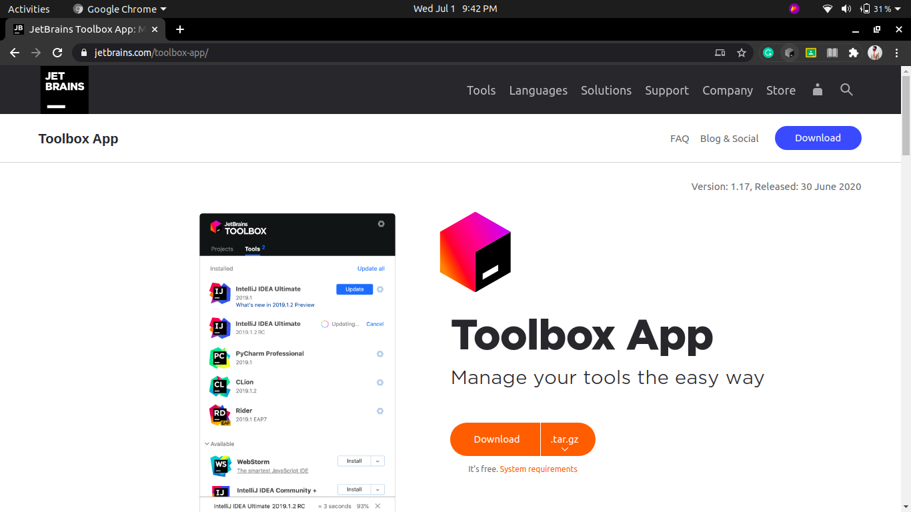

2.  Click on the download button. 

   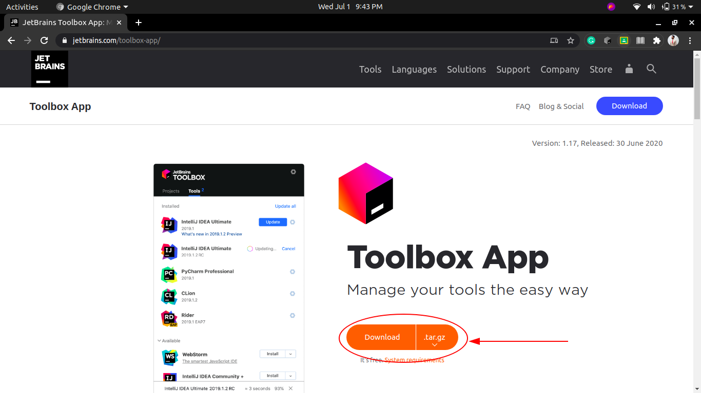

3.  Install the file that has been downloaded to your computer.

4.  After the toolbox app is installed, it looks something like this. Look for the **IntelliJ IDEA Ultimate** option and install it.

   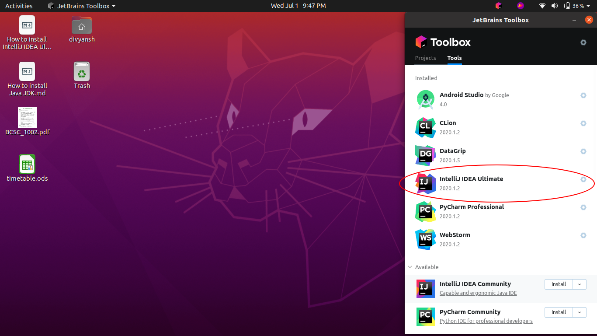

5.  IntelliJ takes a while to load the first time, it opens up like this.

   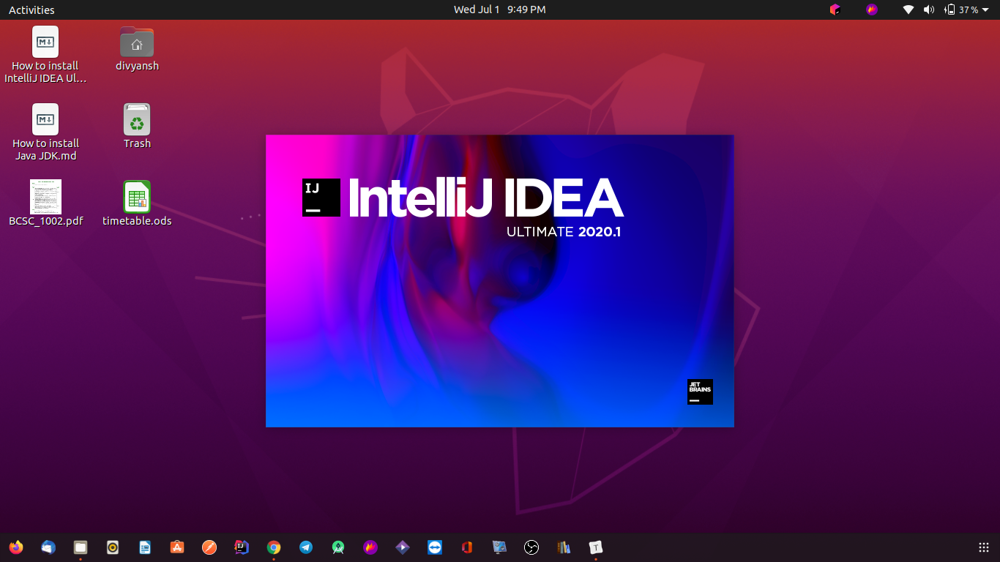

6.  After that, you will need to log in to your toolbox app. Click on "log in".

   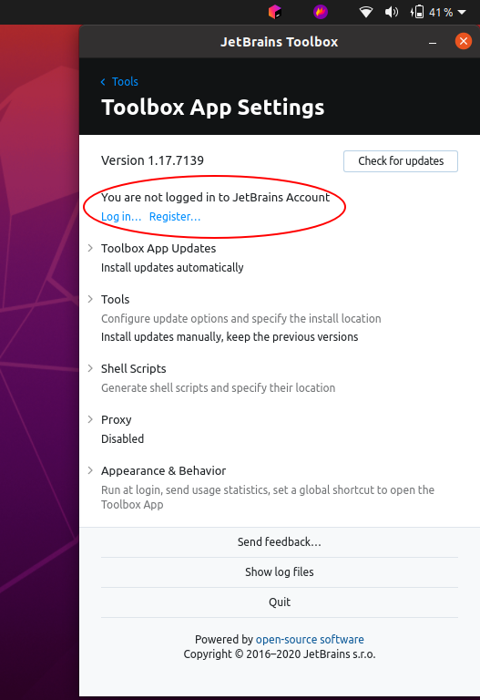

7.  If you have saved your password for JetBrains, it will show you this page, else it will ask you for your username and password first.

   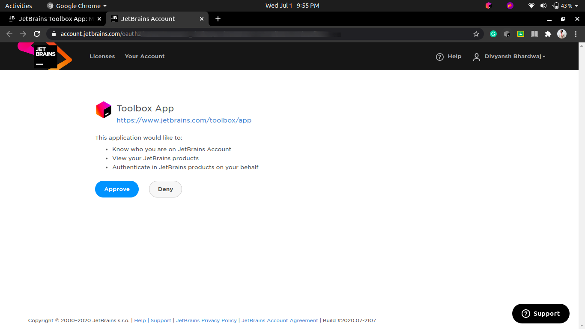

8.  Simply click on "Approve" and it will automatically log into your ToolBox, all your softwares can now be licensed and you can use them freely.